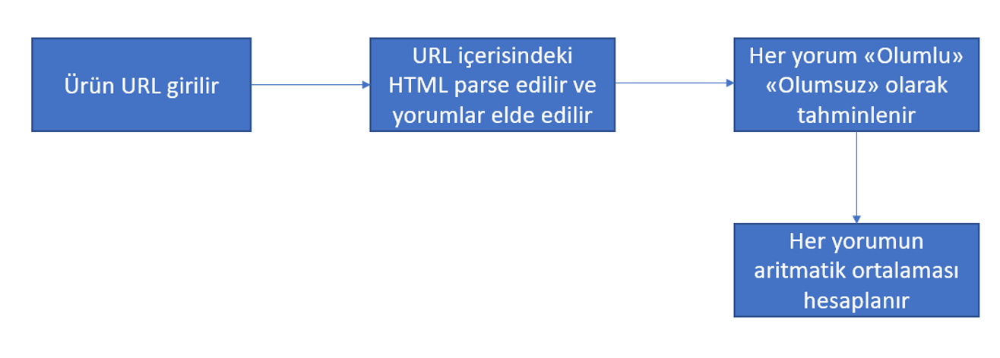
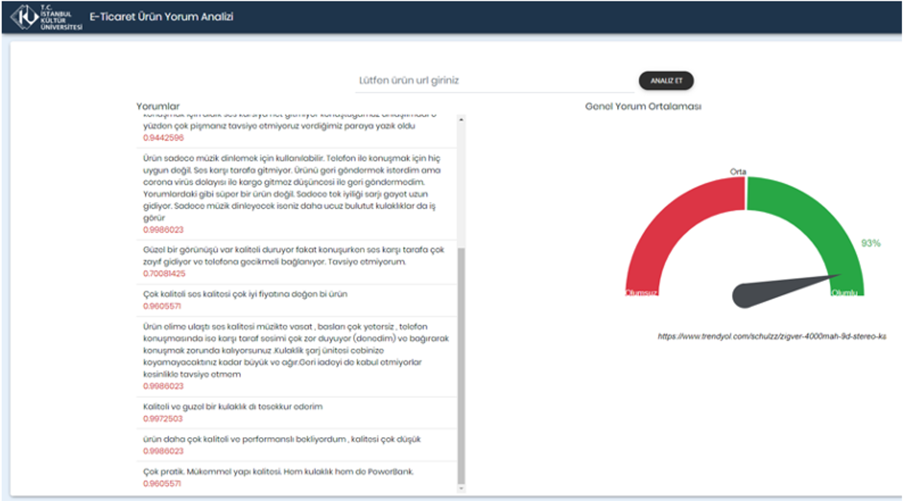
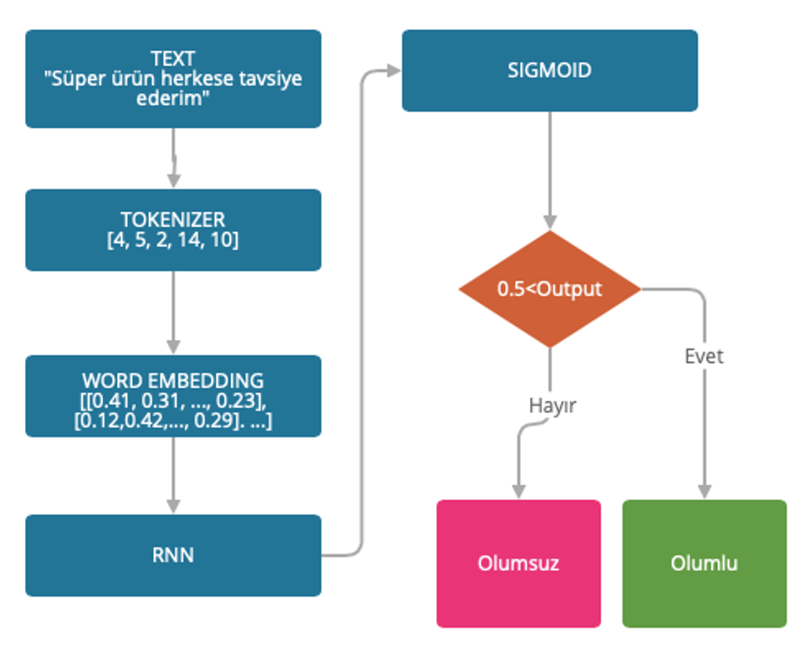

# Sentiment Analysis on Turkish Texts
In this project, I have made a simple web application to analyze sentiments on Turkish texts. I used an e-commerce dataset which had "Rating" and "Review" columns and contains roughly 250.000 commments. Rating column was tagged as 1 for positive comments, 0 for negative comments. In the model, 3-layered LSTM architecture was used. At the end of training, 95% accuracy was obtained. 
All codes were written in Python and Flask was used as a web server.

# Uygulamanın çalışma şekli:

# Web site:

# Model:

## Instructions
git clone https://github.com/serdarketenci/nlp-yorum-analizi.git  
cd nlp-yorum-analizi  
pip install -r requirements.txt
"# nlp-yorum-analizi" 
